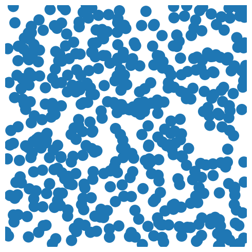
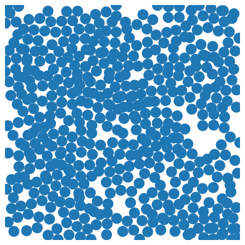
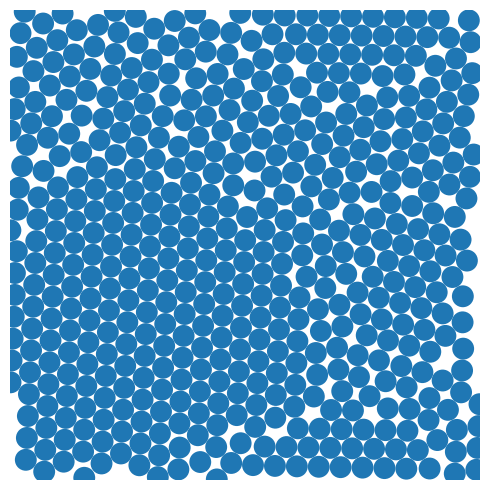

# SwellPy

Liquid suspensions of particles that are sheared back and forth repetitively will organize and “adapt” to
that shearing so long as its amplitude is below some critical value. This organization creates a memory
in the system that can later be “read out” by observing how many particles are perturbed by a given
shear. By partially training the system on multiple shears, multiple memories can coexist. However, by
introducing progressively larger memories, the system “forgets” memories at smaller amplitudes. The
connection between the system’s ability to learn multiple memories and its behavior near the critical
amplitude is unclear. We present a model that allows us to efficiently study this behavior. In place of shear, particles swell to a given amplitude, and overlapping particles are
repelled. This process repeats while the system is monitored. The critical amplitude for these systems
corresponds to the densest packing of disks.

No Memory|Partial Memory|Full Memory
:------------:|:-------------:|:--------------:
||

### Installing
***
This installation requires Anaconda3.

Windows users will also need Visual Studio 2015 Build Tools available here:
http://landinghub.visualstudio.com/visual-cpp-build-tools

To install the package from the application directory, run:   
`pip install -e .`  

If pip fails to install the package due to lapack/blas issues, the easiest way to
solve this issue is to install scipy with anaconda:  
`conda install scipy>=0.18`

See more on this issue at https://www.scipy.org/install.html

SwellPy can then be imported into a python file using:  
`import swellpy`

### Testing
***
To run tests, from the command line run:  
`python setup.py test`

